You'll need some resin coated (RC) silver gelatin paper and some negatives. Everything else should be provided. Following this guide in its entirety will give you *graded prints*. Once you've got the hang of this, you may want to research *split grade printing*, which will give you even greater creative control.

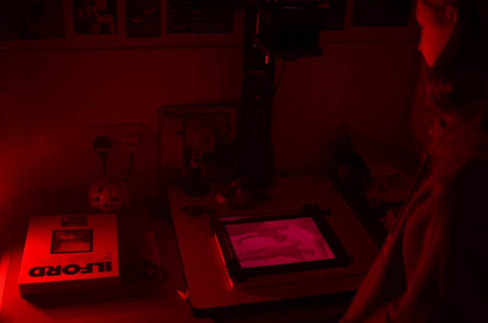

As a general overview, besides setup and cleanup, the process consists of (in order):

1. Making a test strip to determine your exposure.
2. Making test strips to determine your grade.
3. Making a full print which, all going well, will be your final print.

## Contents

1. [Setting up the Enlarger (Durst M605)](#setting-up-the-enlarger-durst-m605)
   
   - [Loading a Negative](#loading-a-negative)
   
   - [Configuring the Condenser](#configuring-the-condenser)
   
   - [Changing the Lens](#changing-the-lens)
   
   - [Setting up the Easel](#setting-up-the-easel)

   - [Framing and Focusing](#framing-and-focusing)
   
   - [Setting the Exposure Time](#setting-the-exposure-time)
   
   - [Setting the Aperture](#setting-the-aperture)
   
   - [Setting a Grade](#setting-a-grade)
   
     
   
2. [Preparing Chemistry](#preparing-chemistry)
   
   
   
3. [Processing](#processing)
   
   - [Moving Paper Between Baths](#moving-paper-between-baths)
   
     
   
4. [Determining Settings](#determining-settings)
   
   - [Making a Test Strip for Exposure](#making-a-test-strip-for-exposure)
   - [Making a Test Strip for Contrast](#making-a-test-strip-for-contrast)

## Setting up the Enlarger (Durst M605)

Our darkroom is equipped with a Durst M605. It can print from negatives up to 6x6, and has a colour head which we can configure to give us *graded prints*. 

[Back to Contents](#contents)

### Loading a Negative

You'll first want to load the negative you want to print into the enlarger. You can do this by taking the negative carrier out of the enlarger head. Be gentle with this as it may be holding up to two sheets of glass.

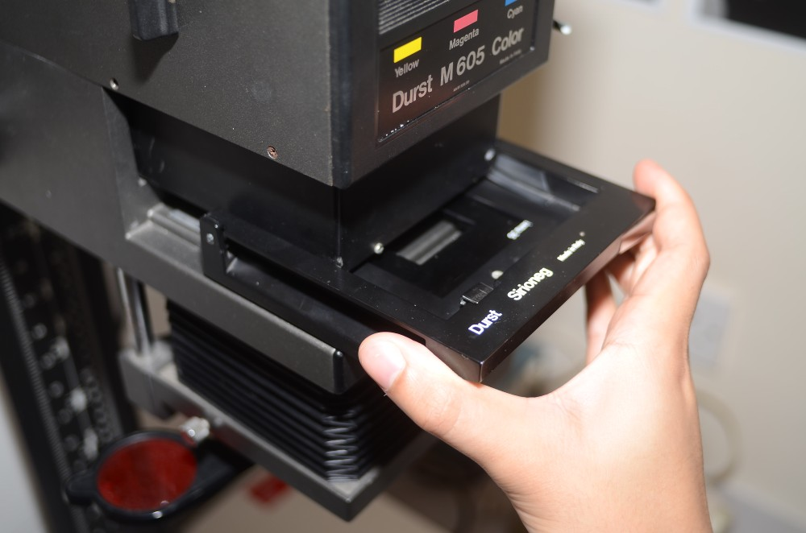

The negative carrier holds two masks/glass sheets; one above and one below the film. These can be removed by pushing them away from the hinge and lifting them from their notches, and installed by doing the reverse.

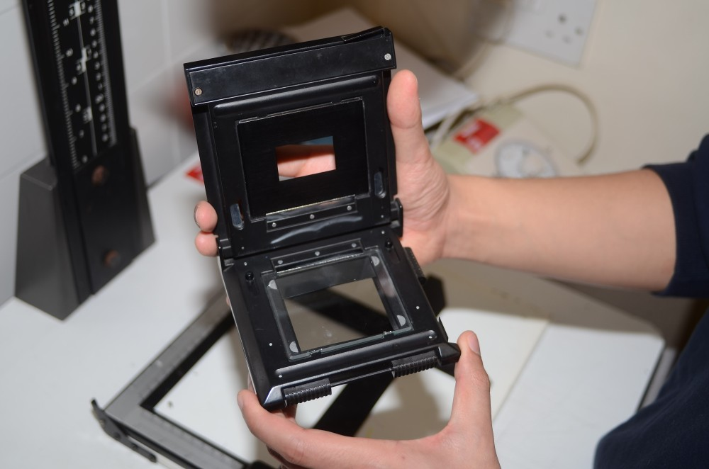

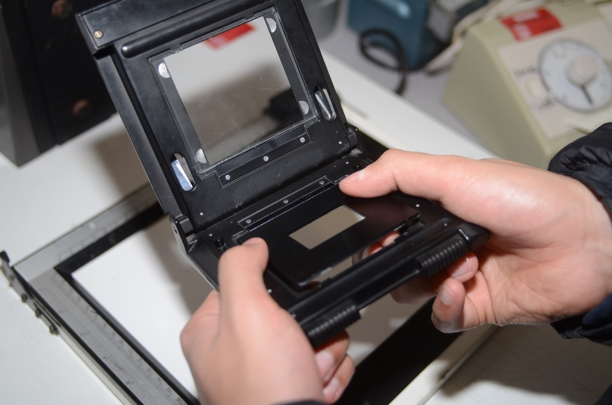

If you're printing 135, then you may choose to use the pair of glassless (metal) 135 masks. If you're printing 120, you may use two glass sheets, or substitute one of the glass sheets for the single glassless (metal) 6x6 mask we have. You can find these in the drawer under the enlarger in an envelope.

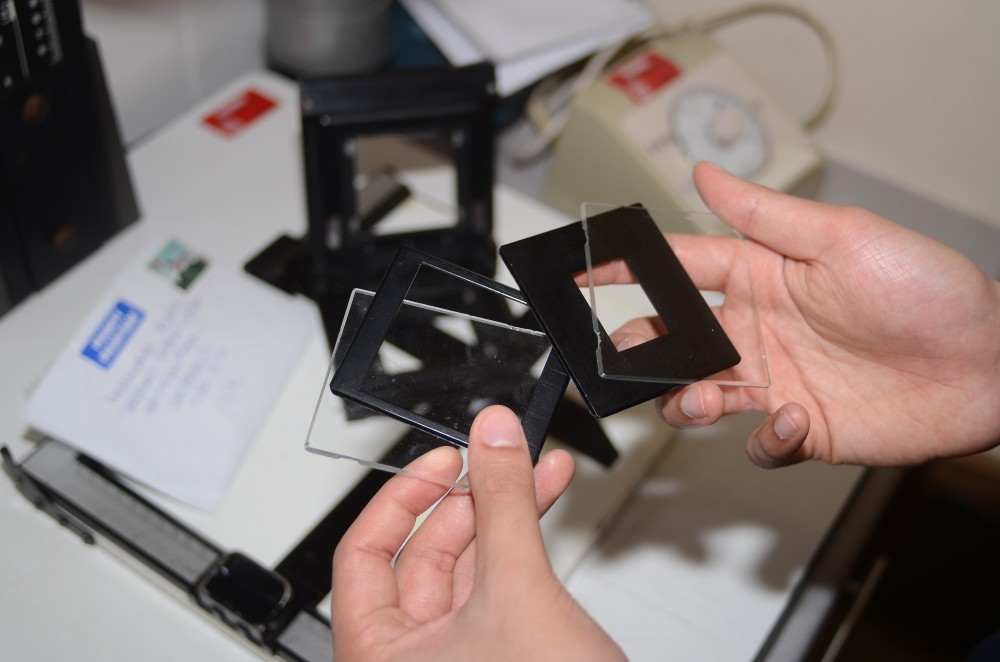

Once you have the masks installed, you want to place your negative in the holder **glossy side up** (emulsion side down), and upside down.

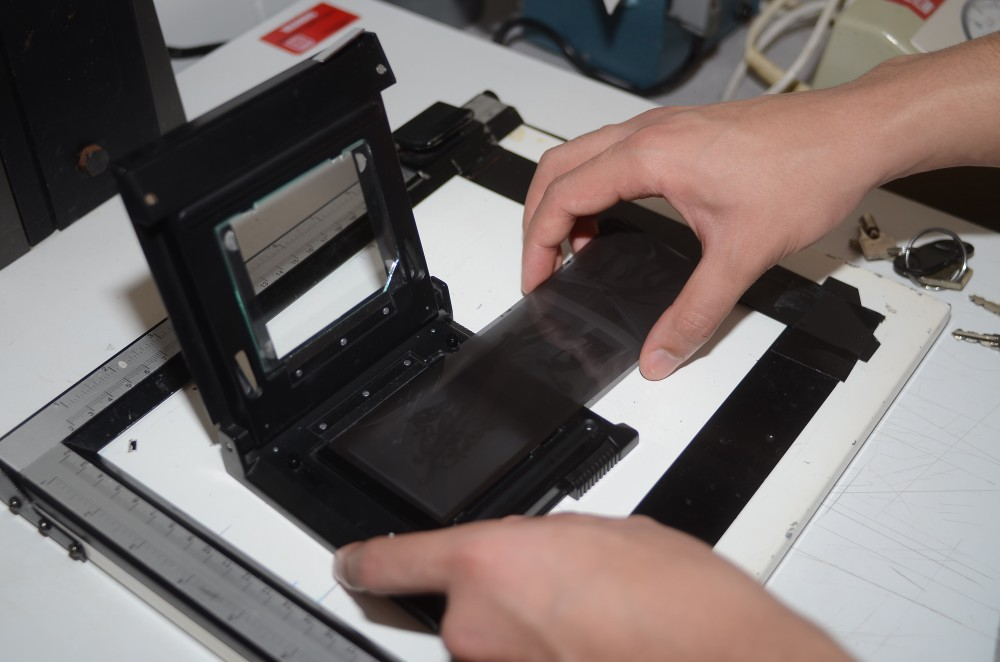

[Back to Contents](#contents)

## Configuring the Condenser

You'll also want to configure the condenser. On the right hand side of the enlarger head, there is a switch. One side is labelled "Box 66", the other "Box 35". If you're printing 135 frames or smaller, you'll want to slide it to the "Box 35" side. If you're printing from anything larger, perhaps medium format, you'll want to switch it to "Box 66". A condenser simply "condenses" light down into a smaller area for smaller negatives, keeping print exposure times lower.

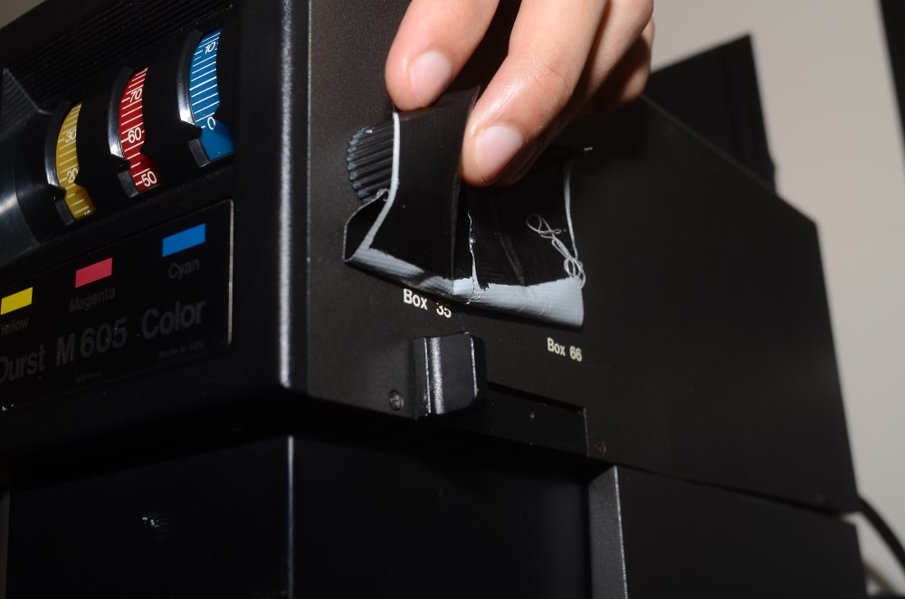

Some tape has been stuck to the side of the enlarger head as a bit of light leaks out of the switch, which is significant enough to bounce off the wall and potentially cause marginal fogging of the paper.

[Back to Contents](#contents)

### Changing the Lens

You may need to change the lens. There is an 80mm lens and a 50mm lens available in the darkroom. For 135 you'll likely want the 50mm lens, while for medium format you might want the 80mm lens. Essentially, a 50mm lens will create a larger projection closer to the enlarger head than a 80mm lens.

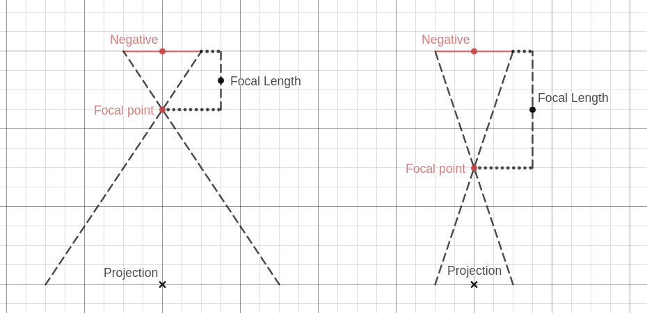

The lens will be mounted to a lens board. These lens boards can be removed, with their lenses, from the enlarger by a thumb screw on the right hand side of the enlarger head. Hold onto the lens as you unscrew this, or it will fall!

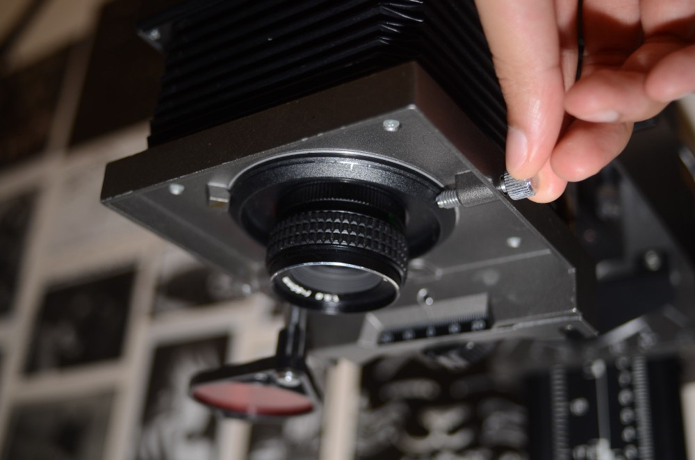

[Back to Contents](#contents)

### Setting up the Easel

An easel is used to give a white border around your print. This white border will not be visible if you properly mount your prints. It is useful for multiple reasons, including:

- Acting as a testing area for spotting inks (inks used for camouflaging dust marks in the final print).

- Protecting the image area if you happen to wash for too long and the emulsion begins to separate slightly from the paper at the edges.

- Giving you an area to hold when you're handling the print that won't risk getting the image area dirty.

The easel is also useful for framing up your print onto the paper (cropping and rotating).

To set up the easel you'll need a sheet of paper the same size as what you're going to be printing onto. If you can't find a sheet of paper the same size, just sacrifice one of your own sheets. 

Put the easel in landscape orientation, lift the easel's arms, place the paper up against the guides on the top left of the easel bed, and put the easel's arms back down. 

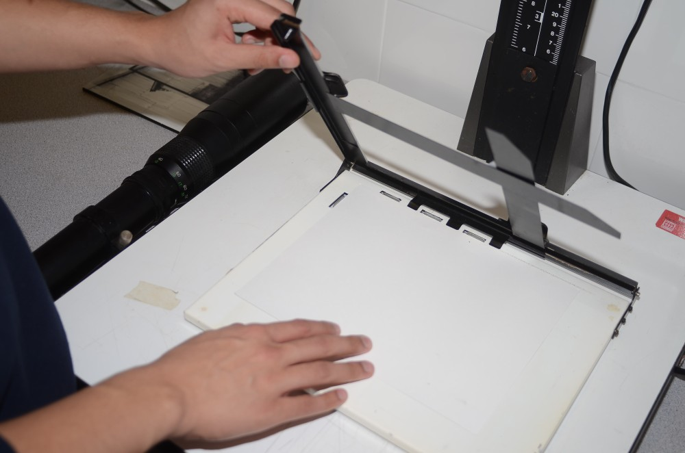

Use a pen to mark the top right corner of the uncovered area of the paper. 

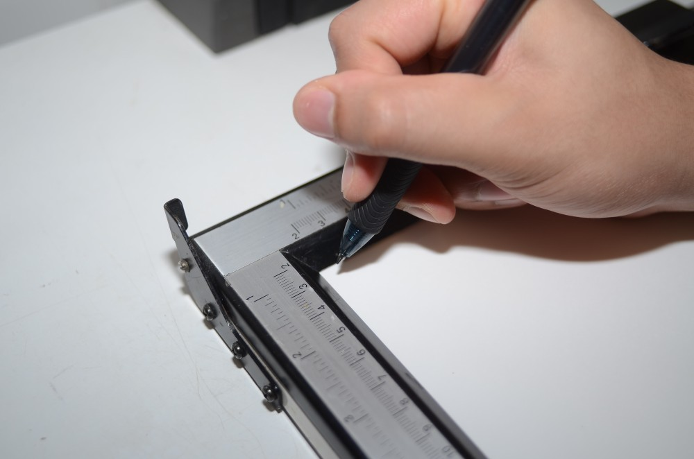

Lift the easel's arms again, rotate the paper 180 degrees, then place the easel's arms back down. 

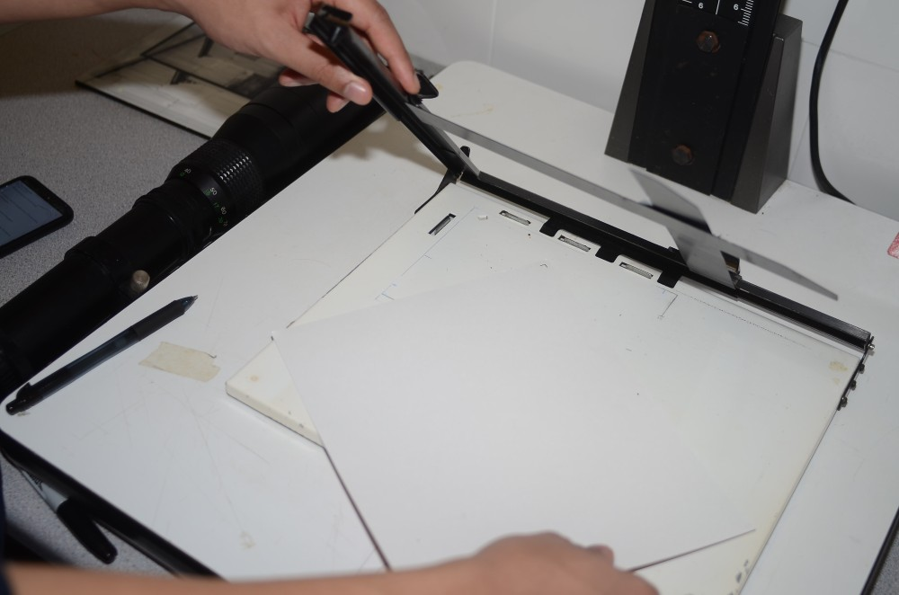

You can now use the mark you made on the paper to adjust your easel's arms' positions to get nice even borders on each side of your print.

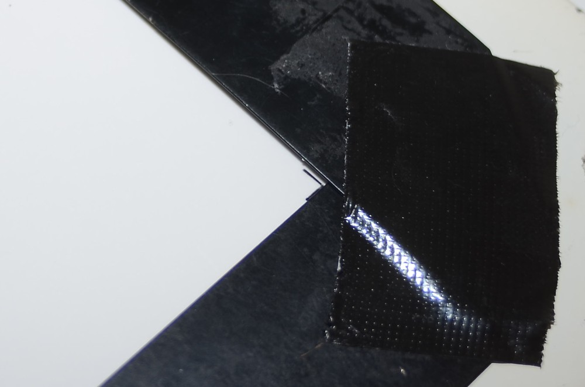

I recommend taping the easel blades together once you've set them up to avoid accidentally knocking them out of place while printing.

[Back to Contents](#contents)

### Framing and Focusing

Once you've loaded your negative and set up your easel, you need to frame and focus your image.

The enlarger has two controls you'll need to use: a crank to adjust the height of the enlarger head, which will change the size of the image; and the focus knob, located just behind the negative carrier on the right.

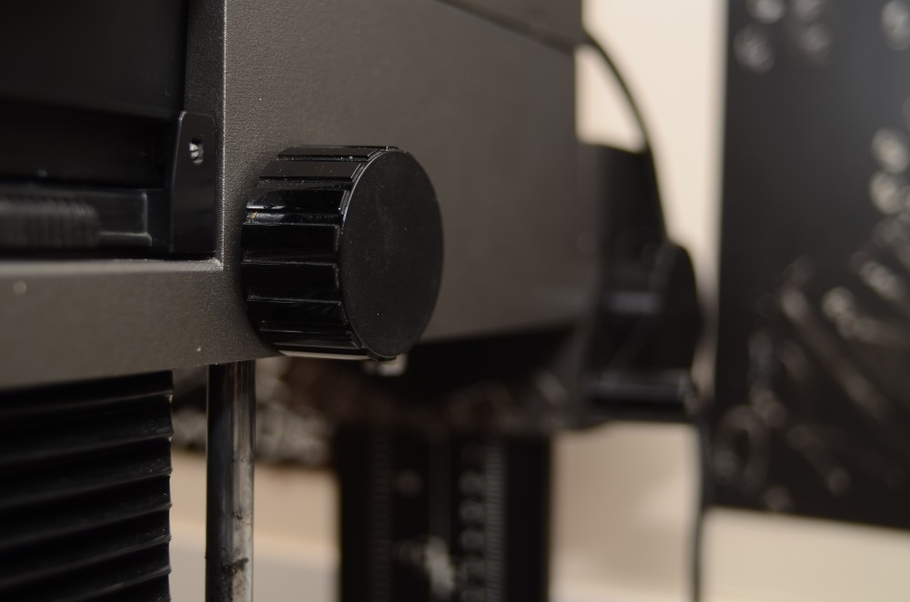

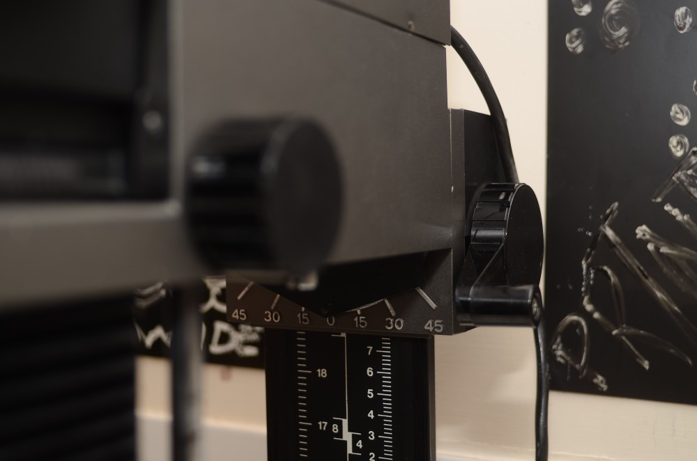

Move the enlarger head while keeping the image in focus by eye, so the image is about the right size for your easel, keeping in mind that enlargers tend to "breathe" a lot (the size of the image will also change when you adjust the focus); and move the easel around to pick a crop and make rotations. You'll likely have to make a crop as the aspect ratio of your frame will probably differ from that of your paper.

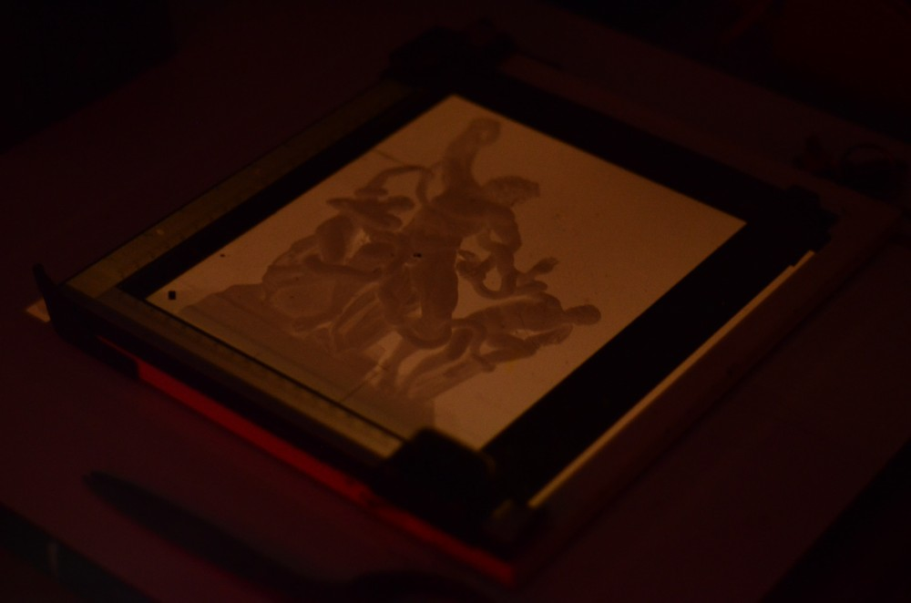

Once you've framed the image up on your easel, you'll need to focus it in more precisely. To do this, find the grain magnifier and place it on the easel bed. Look down the grain magnifier and find a dense area of the negative where the grain is particularly visible, then use the focus knob to bring the grain into the sharpest focus you can.

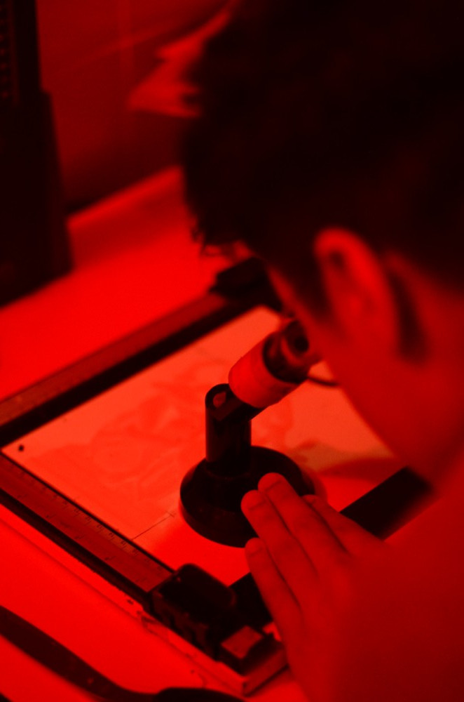

Using the grain to focus an image is useful as sometimes images just don't have any visibly sharp areas.

While focusing, it may be helpful to remove the colour filtration using the aforementioned lever on the left side of the enlarger head, but remember to put it back before you expose your paper!

[Back to Contents](#contents)

### Setting the Exposure Time

Next to the enlarger you'll find its timer. You can test the enlarger is working using the switch labelled "focus" and "timer"; the "focus" option simply turns the bulb on persistently. Don't leave the bulb on for too long, as it will get hot. If the bulb doesn't come on when you switch to "focus", make sure the enlarger is plugged in at the wall, and the power supply (blue metal box) is turned on. 

**Important:** If the enlarger bulb does not light, contact the darkroom officer.

The timer has a dial that can be set to any value between 0 and 6, and a switch to the right with a "sec" and "10x" option. When set to "sec", the time is the value set on the dial in seconds; and when set to "10x" the time is the value set on the dial in seconds, multiplied by 10.

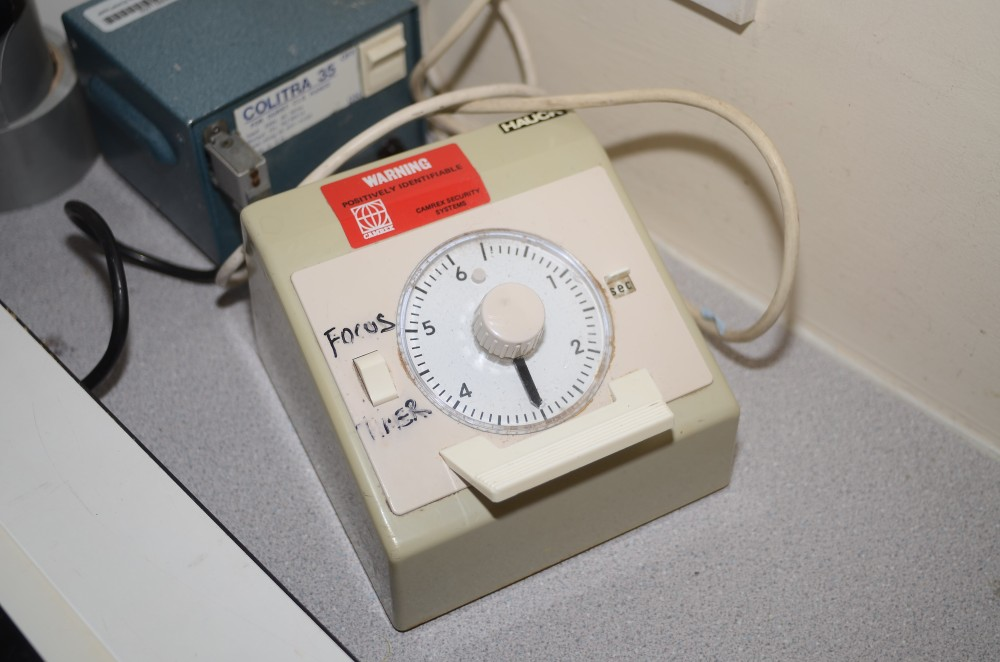

To set the timer to 3 seconds, you'd set the dial to 3 and the switch to "sec". 

To set the timer to 20 seconds, you'd set the dial to 2 and the switch to "10x".

The timer might not actually be that accurate, but it is consistent, so it doesn't matter - if you set it to 5 seconds and it exposes for 4 seconds this isn't an issue as long as it consistently exposes at 4 seconds when you have it set to 5. It will be more accurate with times above 1 second. Don't set the dial to 0.1 and the multiplier to 10x, and expect it to give an accurate 1 second exposure. That's just silly.

[Back to Contents](#contents)

## Setting the Aperture

You can set the aperture by turning the aperture ring on the enlarger lens.

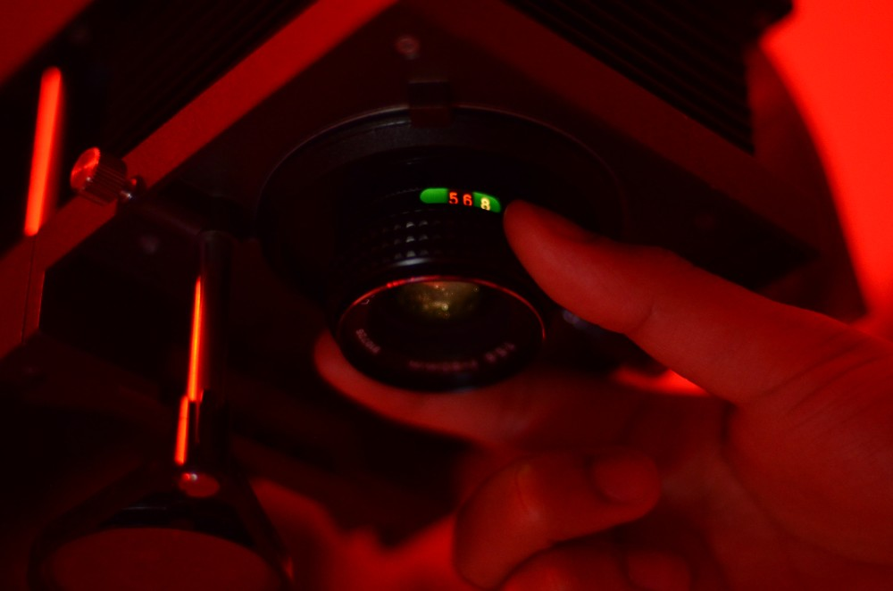

[Back to Contents](#contents)

### Setting a Grade

In years gone by, you used to be able to buy different grades of paper. Higher grades responded to light more quickly, so had higher contrast; while others responded to light more slowly, so had lower contrast. Today we have multi grade paper which allows you to use different grades not by changing the paper, but by changing the colour of the light you expose the paper to. 

[IMAGE: a high and a low contrast print]

On the durst M605, you can set the grade by changing the yellow and magenta settings on its head using the following values for the following grades:

| Grade | Yellow | Magenta |
| ----- | ------ | ------- |
| 00    | 120    | 0       |
| 0     | 88     | 6       |
| 0.5   | 78     | 8       |
| 1     | 64     | 12      |
| 1.5   | 53     | 17      |
| 2     | 45     | 24      |
| 2.5   | 35     | 31      |
| 3     | 24     | 42      |
| 3.5   | 17     | 53      |
| 4     | 10     | 69      |
| 4.5   | 6      | 89      |
| 5     | 0      | 130     |

If you don't already know which grade you want to use, start with a mid grade (2.5). You can easily tweak this later as because these settings use both yellow and magenta, they are **speed matched**. This means changing the grade will not affect your exposure time. 

You can use the magenta alone to control contrast, but settings using just the magenta will not be **speed matched**, so you'll have to figure out a new exposure time every time you change your grade.

The cyan setting is usually left at 0, although it can be used to add neutral density.  

You can use the lever on the left side of the M605's head, labelled "in" and "out", to remove the colour filtration (the print grade) if the colour is making it difficult to focus. Just remember to move this to the "in" position when you come to making a print!

[IMAGE: colour filtration lever on left side of enlarger head]

[Back to Contents](#contents)

## Preparing Chemistry

Put your PPE on as appropriate (gloves, apron, goggles).

You'll need a **developer**, a **stop**, and a **fixer**. You'll need a tray that fits your paper size for each of these, and an individual set of tongs for each bath - don't use the same tongs for everything!

- *Ilford Multigrade Developer* can be found in a **1 litre plastic bottle**. It should be labelled “*Ilford Multigrade Developer*”. You'll need to dilute this for use.

- *Ilford Ilfostop* can be found in a **small 500ml bottle**. It should be labelled “*Ilford Ilfostop*”. You'll need to dilute this for use. If you can’t find any Ilford Ilfostop, you can simply use water instead.

- *Ilford Rapid Fixer* can be found in a **large 5 litre HDPE plastic bottle**. It should be labelled “Ilford Rapid Fixer Mixed 1+4”.
  **Important:** Do not dilute the fixer, it must be reused and diluting it will cause problems for everyone.
  **Important:** Return the fixer to its bottle after use. **Do not pour it down the drain.**

The following volume is a recommended minimum in the case of the **fixer**. It doesn't matter if you use more than this, as you'll be putting it back when you're done with it anyway.

|                                               | Tray Size       | Required Volume (ml) | = Solution (ml) | + Water (ml) |
| --------------------------------------------- | --------------- | -------------------- | --------------- | ------------ |
| **Developer** (*Ilford Multigrade Developer*) | 8x10            | 500                  | 50              | 450          |
|                                               | "the big ones"* | 1000                 | 100             | 900          |
| **Stop** (*Ilford Ilfostop*)                  | 8x10            | 500                  | 25              | 475          |
|                                               | "the big ones"* | 1000                 | 50              | 950          |
| **Fixer** (*Ilford Rapid Fixer*)              | 8x10            | 500                  | 500             | 0            |
|                                               | "the big ones"* | 1000                 | 1000            | 0            |

*"the big ones" can be found in the cupboard next to the equipment cupboard, under the enlarger.

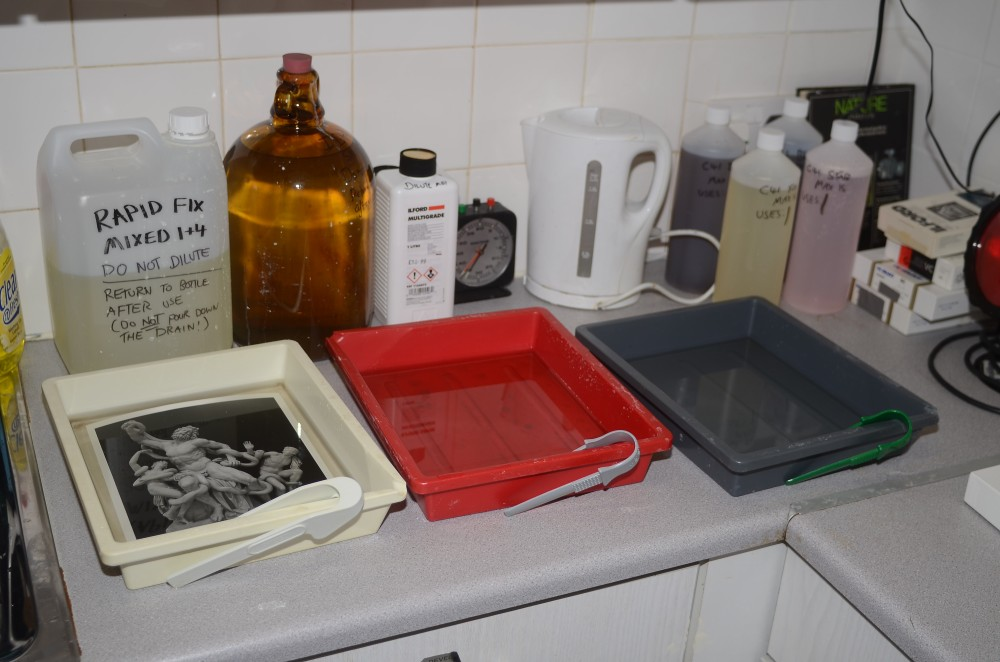

You'll also need to set up the print washer; the big green basin. Attach its hose to the cold tap, and leave it to run. Adjust the angle of the outlet to adjust the height of the water in the print washer.

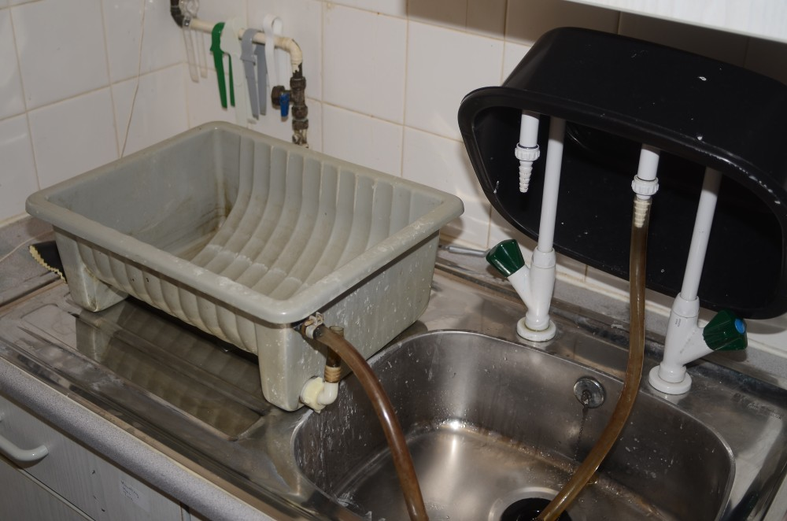

[Back to Contents](#contents)

## Processing

1. Processing B&W silver gelatin paper can be done under safelight. Turn them on, and the main lights off.

   

   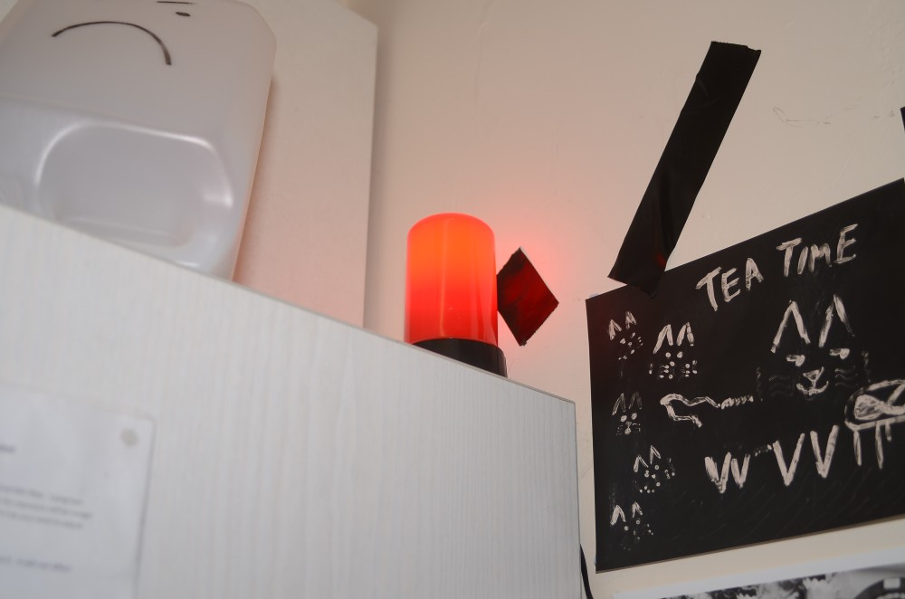

   

   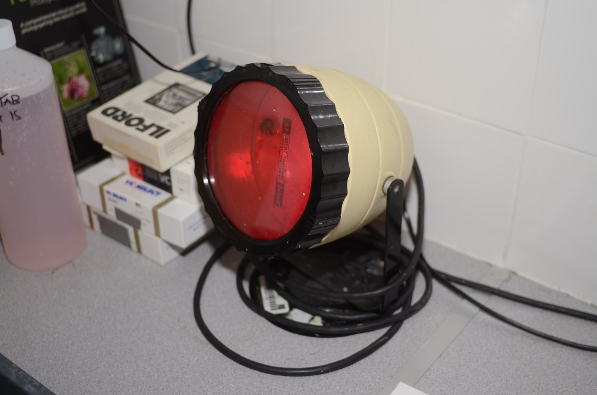

   

2. Quickly submerge your paper in the developer, emulsion side up. You want to do this quickly as to avoid uneven development. This can be done by sliding it into the developer, and "stabbing" it down into the developer with tongs.

   

   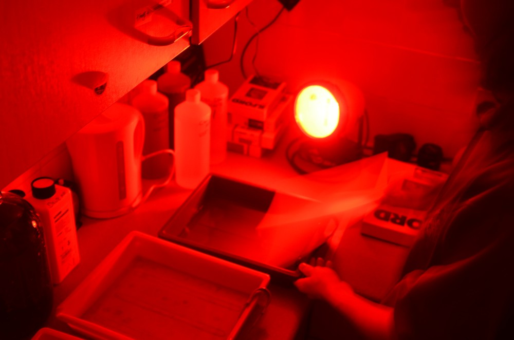

   

3. Let the paper develop for 50 seconds. This time needs to be consistent between prints. Changing the development time will change qualities of the final print that are more consistently controlled by your enlarger settings (exposure and grade). If you start changing your development times you will have problems reproducing your prints. You should agitate the tray during this time, preferably by rocking it by lifting one end of the tray. Do this gently as to avoid spills.
   **Important:** If an image does not appear within 6-15 seconds, contact the darkroom officer.

   

   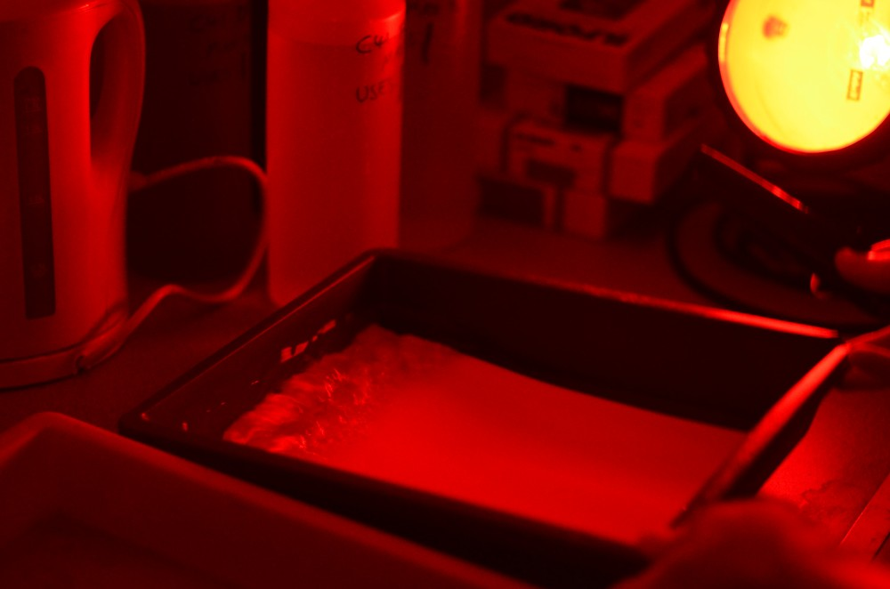

   

   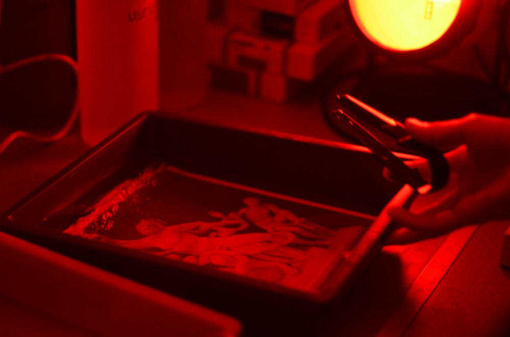

   

4. Remove the paper from your developer with the developer tongs, and allow the paper to drip*.

   

5. Put the paper in your stop bath for 10 seconds. If you're using water, just give it a quick wash.

   **Important:** When *Ilford Ilfostop* is exhausted, it will turn purple, and you need to replace it.

   

6. Remove the paper from the stop bath with the stop bath tongs, and allow the paper to drip*.

   

7. Submerge the paper in the fixer for at least three minutes. I leave it a minute before turning on the main lights, but don't inspect your prints yet. They may look different depending upon the paper's finish when they are dried, particularly if they are a more matt finish.

   

8. Remove the paper from the fixer with the fixer tongs, and allow the paper to drip*.

   

9. Place the paper in the print washer. Leave them in the wash for about 5 minutes. If you leave them to wash for too long the emulsion will peel from the paper at the edges, and if you wash for too short a time then you'll end up with residual fixer in your print that'll cause stains.

   

10. Hang the prints up to dry; don't let them touch as they dry or they will stick together. If they do stick together, you may be able to separate them by soaking them in water again for a few minutes.

[IMAGE: picture(s) hung up to dry]

[Back to Contents](#contents)

### *Moving Paper Between Baths

When moving the paper between the developer, stop, fixer and wash, hold the paper over the tray and allow as much of the fluid contained within the paper as you can to drip out of it first. If you don't do this, you'll find that your stop bath will become purple very quickly, and you'll exhaust the fixer a lot quicker.

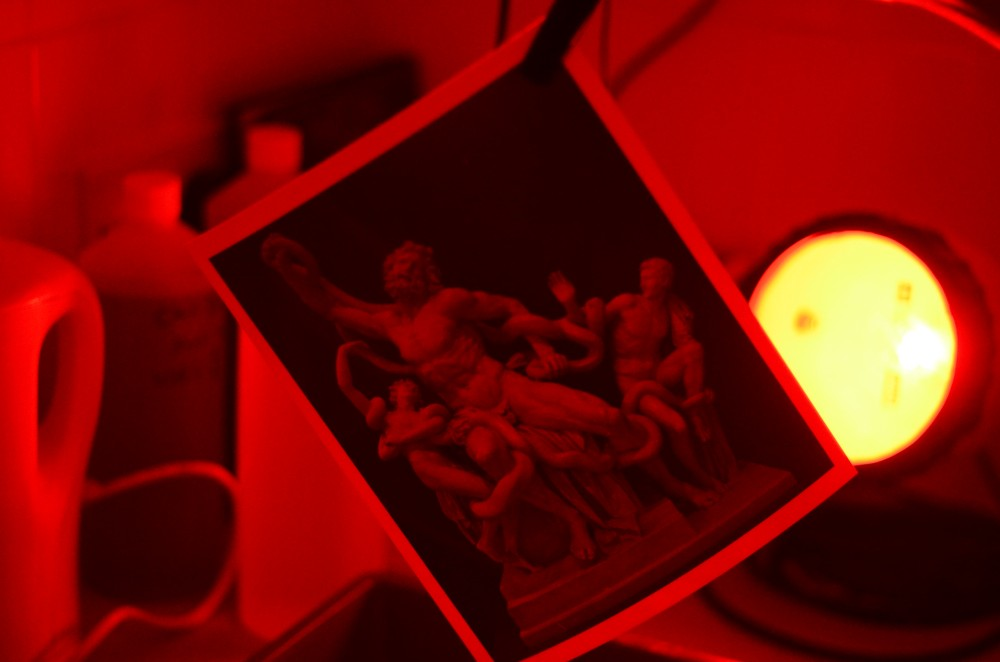

[Back to Contents](#contents)

## Determining Settings

You'll need to figure out at least what your **exposure time** is, and if you're wanting good prints you'll want to change your **grade**. Your **exposure time** will determine the overall density of the print (how light/dark it is), while your **grade** will determine the contrast of the print (how fast it goes from light to dark).

The first step is to determine a good **exposure time**. You can do this by making **test strips**.

**Test strips** are just prints made on strips of paper as opposed to entire sheets, this is done for better economy; there's no need to waste entire sheets of paper to determine your exposure time. You can just take one sheet, and cut it up into several strips. I cut mine about an inch wide, but if you're running out of paper it's only prudent to cut them thinner!

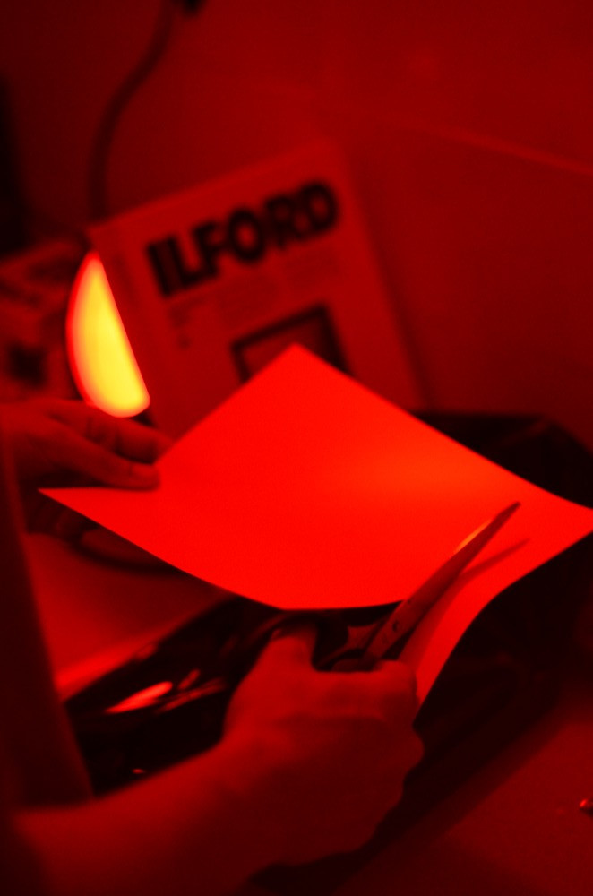

[Back to Contents](#contents)

### Making a Test Strip for Exposure

Set the aperture on the enlarger to the darkest possible setting before you can't see what's in the image, then make it a stop brighter. This is a good starting point and if it doesn't work out, it can be changed later.

Set the enlarger timer to 3 seconds, and find something large and opaque with which to cover the paper. There should be a book somewhere that you can use for this.

Cover all but half an inch of the strip of paper with the book, holding it as still as possible while being careful not to move the paper, and start the enlarger timer to make a 3 second exposure. Uncover a little bit more of the paper and expose it for 3 seconds again. Repeat this over the whole test strip. You should end up with a test strip that has several brackets of exposure (3 seconds, 6 seconds, 9 seconds...). It's best to do at least 5 of these brackets.

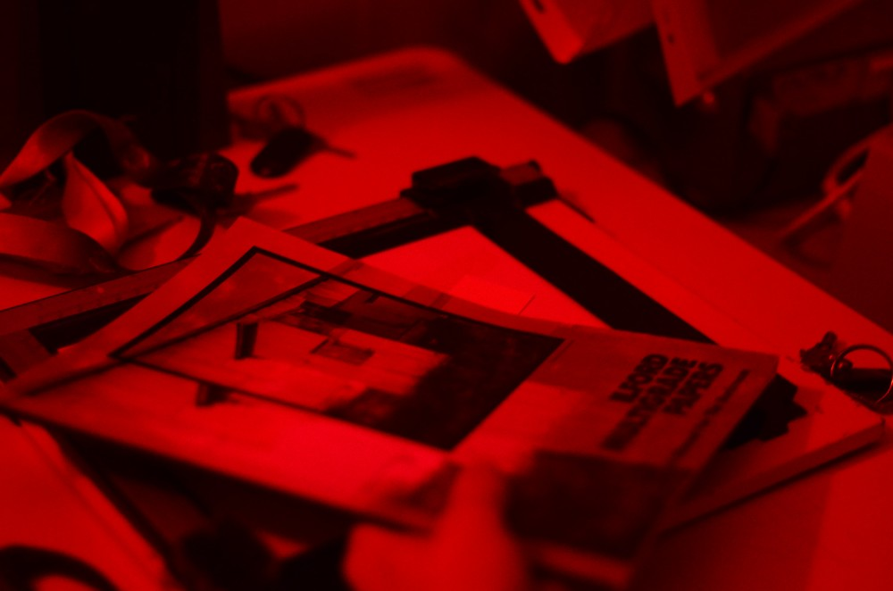

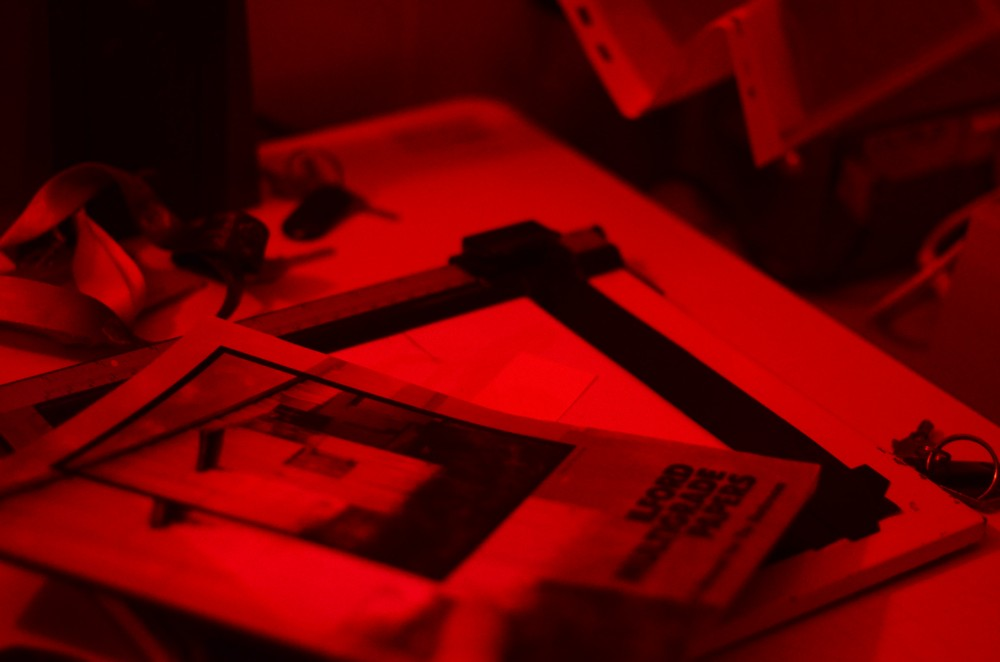

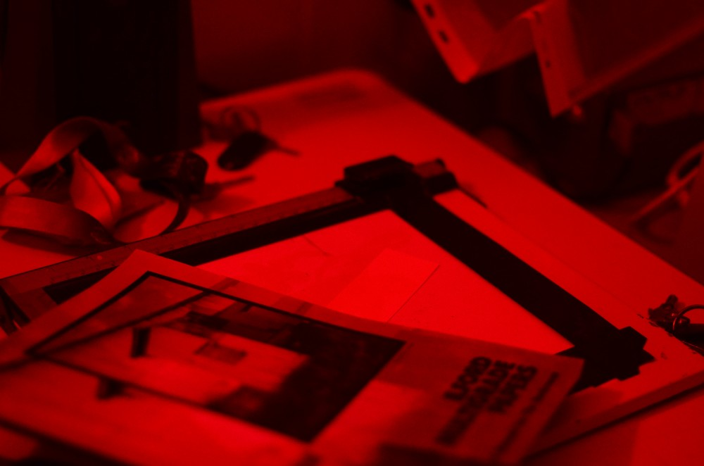

Pick the bracket that looks well exposed (not too dark, not too bright) based upon the context of what part of the image is in that bracket. It's best to orient the test strip over an area of the image that'll be easy to determine your exposure.

If the difference between each bracket isn't very substantial, open up your aperture by a stop. Conversely if the difference between each bracket is too substantial, or all the brackets are too dark, close down the aperture by a stop.

If all the test exposures are too light, then try doing a base exposure over the whole test strip up to the exposure where you start to see the image.

[IMAGE: three test strips; one good, one too dark, and one too light]

[Back to Contents](#contents)

### Making a Test Strip for Contrast

Making a test strip for contrast is much easier than one for exposure. You should have made the exposure test strip at a mid grade (2-3). Expose another entire test strip for the exposure time you chose, using part of the image from which you'll be able to judge the contrast. If the contrast looks too low, increase it by using a higher grade and make another test strip. If the contrast is too high, decrease it by using a lower grade and make another test strip. It's that simple!

[IMAGE: several test strips of different contrasts]

[Back to Contents](#contents)

