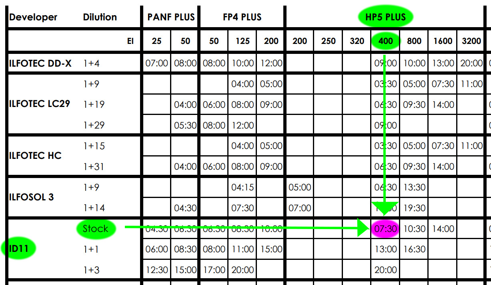

ID-11 is a black and white film developer. It will not work well for chromogenic films and some black and white films are chromogenic! Check your film doesn't say "C-41" somewhere on it. If it does, then it needs to be processed like a colour negative film.

## Before We Begin - If Things Go Wrong

If things go wrong, it doesn't matter, as long as you tell us about it!

You will not be held responsible for pouring fix into our developer or anything silly like that. It's easily replaced. We just need to know **as soon as it happens**, as we don't want other people to use dodgy chemistry - their pictures *aren't* easily replaced!

Failing to report incidents **as soon as possible** will result in your darkroom access being revoked.

## Determining Your Development Time

You'll need to find your **development time**. You can find this on the development chart that should be mounted on the door of one of the cupboards. Find the time in the row for *ID-11 Stock*, in the column that corresponds to the film you have and the ISO you exposed it at (e.g., *Ilford HP5* @ ISO 400), like in the example below.

You can find a digital copy of the chart here:

[https://www.ilfordphoto.com/amfile/file/download/file/1953/product/1650/](https://www.ilfordphoto.com/amfile/file/download/file/1953/product/1650/)

If you can't find your film on this chart, check the massive dev chart online:

https://www.digitaltruth.com/devchart.php

If you can't find it on the massive dev chart, [contact a darkroom officer](#contact).

You'll then need to find the number of times our developer, *Ilford ID-11* (found in a large 5 litre amber glass bottle), has been used. This should be documented somewhere in the darkroom. Every time it is used it becomes weaker (exhausted), and you need to compensate for this by extending your **development time**.

If you can't find how many times the *ID-11* has been used, [contact a darkroom officer](#contact).

To figure out your **compensated development time**, you need a multiplier from the following table:

| Uses       | 1-5  | 6-10 | 11-15 | 16-20 | 21-25 | 26-30 | 31-35 | 36-40 | 41-45 | 46-50 |
| ---------- | ---- | ---- | ----- | ----- | ----- | ----- | ----- | ----- | ----- | ----- |
| Multiplier | 1    | 1.1  | 1.2   | 1.3   | 1.4   | 1.5   | 1.6   | 1.7   | 1.8   | 1.9   |

You then need to multiply your **development time** by this multiplier to get your **compensated development time**.

For example, *Ilford HP5* @ ISO 400 in *Stock ID-11* has a development time of `7 minutes and 30 seconds`. 

This is `7 * 60 + 30 = 450` seconds. If the *ID-11* had been used `23` times, I would multiply this by `1.4`, so my **compensated development time** would be `450 * 1.4 = 630` seconds (or `10 minutes 30 seconds`).

## Preparing Chemistry

Put your PPE on as appropriate (gloves, apron, goggles).

You'll need a **developer**, a **stop**, and a **fixer**. You'll need a measuring cylinder for each of these.

- *Stock ID-11* can be found in the **5 litre amber glass bottle**. It should be labelled “ID-11”.
  **Important:** Do not dilute the ID-11, it must be reused and diluting it will cause problems for everyone.

- *Ilford Ilfostop* can be found in a **small 500ml bottle** in the chemicals cupboard. You'll need to dilute this for use. It should be labelled “Ilfostop”. If you can’t find any Ilford Ilfostop, you can simply use water instead.

- *Ilford Rapid Fixer* can be found in a **large 5 litre HDPE plastic bottle**. It should be labelled “Ilford Rapid Fixer Mixed 1+4”.

The following volumes are recommended minimums in the case of the **developer** and **fixer**. It doesn't matter if you use more than this, as you'll be putting it back when you're done with it anyway.

|                                      | Films    | Required Volume (ml) | = Solution (ml) | + Water (ml) |
| ------------------------------------ | -------- | -------------------- | --------------- | ------------ |
| **Developer** (*Stock ID-11*)        | 1x135`*` | 300                  | 300             | 0            |
|                                      | 1x120    | 500                  | 500             | 0            |
|                                      | 2x135`*` | 600                  | 600             | 0            |
| **Stop** (*Ilford Ilfostop*)         | 1x135`*` | 300                  | 15              | 285          |
|                                      | 1x120    | 500                  | 25              | 475          |
|                                      | 2x135`*` | 600                  | 30              | 570          |
| **Fixer** (*Ilford Rapid Fixer*`**`) | 1x135`*` | 300                  | 300             | 0            |
|                                      | 1x120    | 500                  | 500             | 0            |
|                                      | 2x135`*` | 600                  | 600             | 0            |

`*`135 = "35mm" film

`**`The *Ilford Rapid Fixer* has already been diluted for you.

For measuring out small volumes (in the case of *Ilfostop*), you should be able to find a small 50ml measuring cylinder somewhere in the darkroom.

You should also be able to find a 200ml syringe to help getting the *ID-11* and *Ilford Rapid Fixer* out of their 5l bottles and into the graduates.

## Agitation

Processing will require you to agitate the development tank. This should be done gently. Too vigorous agitation will result in **surge marks**, while too little will result in **bromide drag**.

I agitate for the first thirty seconds of development, then for the last 10 seconds of every subsequent minute, although this is not the only method. You may prefer something else, like continuous agitation. You may find rollers in one of the drawers for this, but I find the tanks tend to leak.

You may invert the tank while agitating, but do not leave it inverted for more than a few seconds. 

You should tap the development tank gently on the wet bench to dislodge any air bubbles after each agitation, but be careful; the tanks are not indestructible, they will crack!

## Processing

1. Prepare a timer with your **compensated development time**.
   **NOTE**: The timing of the development time is critical. Aim to keep it within +/- 10 seconds.
   
   
   
2. Pour your **developer** from the measuring cylinder into your development tank, start your timer, then agitate as described under the **Agitation** section until the timer goes off.
   
   
   
3. Pour the **developer** back into its measuring cylinder.
   
   
   
4. Pour your **stop** from its measuring cylinder into your development tank, then:

   1. Agitate the development tank for ~10 seconds (just count to ten).

   2. Wait ~10 seconds (just count to ten).

   3. Pour the **stop** back into its measuring cylinder.

      **Important:** This time is a recommended minimum, although longer times may result in stains that will require thorough washing to remove.
   
   
   
5. Prepare a 5 minute timer.
   **Important:** This time is a **strong** guideline. Shorter times may result in purple negatives. Longer times may result in **permanent** stains.
   
   
   
6. Pour your **fixer** from the measuring cylinder into the development tank, start your timer, then agitate as you did for the developer until the timer goes off again.
   
   
   
7. Pour the **fixer** back into its measuring cylinder.
   
   
   
8. Fill your development tank with water from the cold tap, then invert it 5 times and pour the water back out. Repeat this twice more, inverting 10 times then 20 times.
   
   
   
9. At this stage you can open your development tank and inspect the sides of the film for edge markings and frame numbers to ensure it's developed. You likely won't be able to see images while the film is wrapped around the spiral, but don't remove it yet!
   
   
   
10. Put your film back in its development tank and leave it under a running tap for 5 more minutes.
    In the meantime, you can:
    
    1. Pour the **fixer** (will smell of vinegar) back into its bottle as it can be reused.
    2. Pour the **developer** (ID-11) back into its bottle as it can be reused.
    3. **Important:** Please don't mix up the fixer and developer. If you do accidentally pour fix into developer or developer into fix, [contact a darkroom officer](#contact) **IMMEDIATELY**.
    4. You can reuse **stop** (which will normally be yellow) until it turns purple. Unless you're going to reuse it immediately, pour it down the drain.
    5. Rinse out the measuring cylinders you used and leave them to dry.
    6. Wipe down the wet bench with paper towels.
    7. Remove your gloves, and return your other PPE to where it belongs.
    8. Return any tools (scissors, bottle opener...) to their drawers.
    9. Put your scrap film/backing paper/film canisters in the bin.
    10. **Important:** Mark down how many films you developed so the next person knows how much they need to compensate their development time!

   

11. An optional addition is to run your film through a final bath of *Ilfotol Wetting Agent*. This isn't generally necessary in our darkroom as Sheffield's water is fine. It needs to be diluted 1+200 for use. There is a 15ml measuring cylinder somewhere in the darkroom that will help you measuring out these small volumes of concentrate.

    | Films  | Total Volume Required (ml) | *Ilfotol* (ml) | Water (ml) |
    | ------ | -------------------------- | -------------- | ---------- |
    | 1x135* | 300                        | 1.5            | 298.5      |
    | 1x120  | 500                        | 2.5            | 497.5      |
    | 2x135* | 600                        | 3              | 597        |

   

12. Hang up your film to dry, then: 

    1. With clean hands, no more than three times, squeegee it between your index and ring finger.
       **Important:** I do not recommend using actual squeegees; a single bit of grit on one of these will leave a big scratch down the entire length of your film!
    2. Attach two pegs to the bottom of your film to weigh it down. As it dries, it will warp and bend. This is fine as long as you have attached pegs, once it's properly dried it will be nice and flat.

## Troubleshooting

If something hasn't gone quite right, always [contact a darkroom officer](#contact) so we can be sure of what's gone wrong, even if it's listed here.

- **Drying Marks**: 
  Drying marks can be removed using countless methods. Isopropyl alcohol and a microfiber cloth works for me, but you can find countless other solutions online. Just be careful if the marks are on the emulsion (matt) side of the film as if you scratch this, you're scratching your image off the film! The glossy side is more robust but while there exist solutions to fix scratches on this side, it's best not to scratch it in the first place, so be gentle.

- **Purple Negatives**: 
  This can be caused by inadequate washing or under fixing. First try running the film under the tap for a further three minutes. If this doesn't work, try fixing and then washing the film again. If the film is still purple, please [contact a darkroom officer](#contact).

- **Orange Negatives**: 
  Your film was supposed to be processed in C-41 chemistry.

- **Film Has Trails Of Lesser Density Trailing From The Sprocket Holes**: 
  This is called bromide drag. It is caused by insufficient agitation during development.

- **Film Has Denser Areas Around/Trailing From The Sprocket Holes**: 
  If they are uniform marks trailing from the sprocket holes in pairs, and you are left handed, they may be stress marks from winding the film back into its canister backwards. Otherwise, these are probably surge marks, generally caused by over agitation during development.

- **Film Is Entirely Dense (Black)**: 
  This will happen in normal use to the leader of the film, as it will be exposed to light before the camera is loaded. If it occurs across the whole film, or in midsections, a severe light leak has occurred (perhaps by opening the camera back mid-roll). You might also have developed your film under an unsuitable safelight. Panchromatic films are generally not developed under a safelight.

- **Film Has Other Strange Dense Marks**: 
  These may be light leaks. It may be possible to determine how the light leak happened by the geometry of the light leaks. For example, if it looks like the film has been marked with a shadow of itself it was likely fogged while it was being loaded into the development tank. If the light leaks are repetitive, align with frames, or emanate from the edges of the film (not the sprockets), it may be a light leak in your camera.

- **Film Is Greyish, But There Are Images**: 
  Your film was likely fogged, although some films have a high base+fog than others, so a grey base colour may be normal. This is typical with expired films.

- **Film Is Clear, But Has Edge Markings**: 
  The edge markings are indicative of the fact that the film was developed properly. The film was simply not adequately exposed, if at all.

- **Film Is Clear And Has No Edge Markings**: 
  This will usually occur if the film is fixed before it is developed.

## Storage

I recommend you store your negatives flat, as otherwise they will be difficult to scan and print from.

The best solution is to get yourself some archival sheets. They should be easy to find online.

## Contact

You can contact a darkroom officer at [shefuniphotosoc@gmail.com](shefuniphotosoc@gmail.com).

